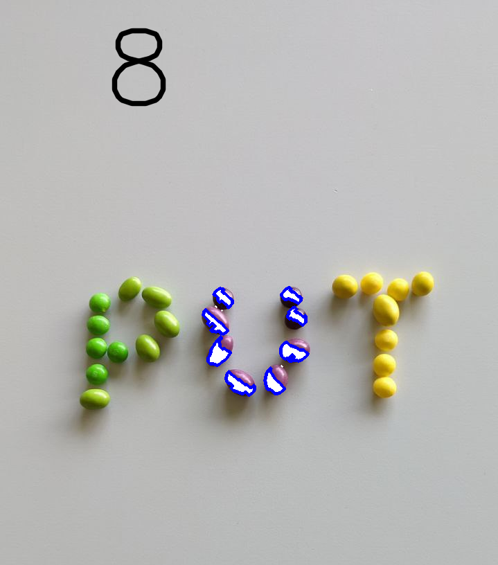
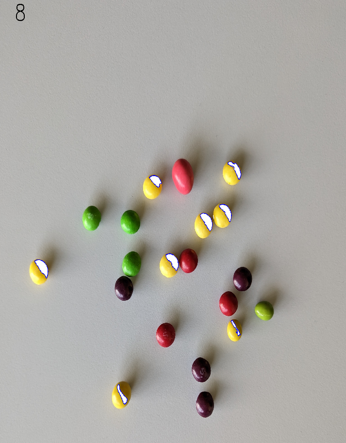
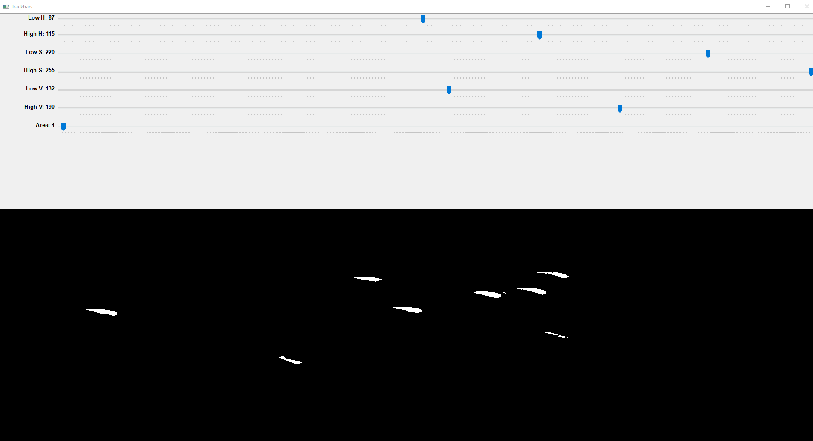
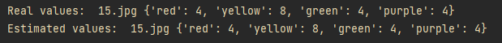
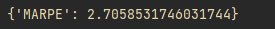

# Candy recognizer 
## End of semester project for Introduction to Image Processing
> The recognition and counting of round, m&m's-like candies in four colors: green, yellow, red and purple in a given photo

## MARPE indicator for final dataset: 2.70 
MARPE indicator for test dataset: 0.98 (if implemented correctly) \
MARPE indicator is calculated using formula: \
MeanAbsoluteRelativePercentageError[%] = $\frac{100}{n} \Sigma^{n-1}_{t=0} \frac{ |y_r-\hat{y}_r| + |y_y-\hat{y}_y| + |y_g-\hat{y}_g| + |y_p-\hat{y}_p|}{y_r + y_y + y_g + y_p}$

## General Information
- The main goal of candy_recognizer is to process an image of different colored candies and return number of candies of the same color
- Algorithm focuses on standard image processing techniques to filter a contour of a given color (operating on HSV values)
- Chain of operations: 
  * convert from RGB to HSV
  * apply light bilateral filter
  * threshold using inRange() with selected parameters (depending on a color)
  * create a kernel with cv2.MORPH_ELLIPSE
  * obtain a mask using a morphological operation cv2.MORPH_CLOSE and then cv2.MORPH_OPEN with created kernel
  * use findContours() with created mask
  * iterate through every contour, if bigger than fixed size then count as detected 
    ```python
    if cv2.contourArea(contour) > area * height * width:
    ```
    where *height* and *width* are dependent on the dimensions of the photo


## Technologies Used
- Python 3.9
- OpenCV 4.5.3
- NumPy 1.24.1
- tqdm 4.64.1


## Features
- Detecting the number of candies in a given photo or set of photos (*detect.py*)
- Communication with external website to perform detection on a final dataset (*check.py*)
- Additional script for configuration and fine-tuning of the algorithm using test dataset (*testing.py*):
  * trackbars for configuration of lower and upper boundries of HSV detection as well as an area detection
  * reading from and writing to a .json configuration file to store configured parameters of the algorithm
  * displaying the number of candies found with the currently configured color parameters
  * marking contours that are currently taken into account by the algorithm


## Screenshots





<!-- If you have screenshots you'd like to share, include them here. -->


## Setup
A requirements.txt with versions of currently used packages is located in the main folder.
To fine-tune the algorithm use *testing.py*. 
```python
#===INPUT COLOR HERE===#
selected_color = 'purple'
#=====================#
```
Change **selected_color** to one of the given: *green*, *yellow*, *purple*, *red* to change parameters of this color detection.

```python
#===INPUT DATA DIRECTORY HERE===#
image_dir = r'C:\Users\dawidexpompa2000\Desktop\Srudia\PO5_WDPO\Laby\WDPO_candy_recognizer\data'
#==============================#
```
Change **image_dir** to your data folder location.


## Usage
In *testing.py* file, after starting the program you can use keys:
* Q and W to switch back and forth through a content of a currently selected folder (default: ./data folder)
* D to detect candies on a currently shown picture (prints: filename.extension + real and detected values)
* P to detect candies on all pictures in a currently selected folder (prints: MARPE indicator)
* esc to save trackbar values to .json file and exit program


## Project Status
Project is: _complete_ 


## Room for Improvement
Room for improvement:
- Fine-tune parameters for different colors to decrease MARPE indicator 
- Implement try except blocks

To do:
- [ ] Better visualization of the working algorithm (draw all detected contours)
